 
# 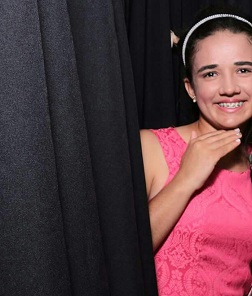   
*  *   *   
     
# "O sorriso esconde infinitos pretextos." -Lucas Lavarini 💚
 

# Quem sou eu

Meu nome é Juliana Bezerra de Lima, tenho 17 anos estudo no Ifrn/Ceará-Mirim no Curso de Jogos Digitais, estou usando esse site para fazer um portfólio da materia de Motores, com o Professor Marcelo Barbosa. 

# Informações pessoais
Email:Julianabezerra.touros@gmail.com   
       
   

# Portfólio

# Frase Motivadora
#  
# "A felicidade está nas coisas mais simples da vida." 

## Empresa

# 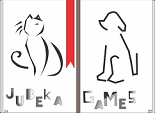
 
## Games

* Tema: Cultura   
>Descrição:<   
No jogo Protetores da Floresta com a sua ajuda o Saci ou Curupira tem a missão de salvar a floresta dos lenhadores para assim salvar as suas árvores.

[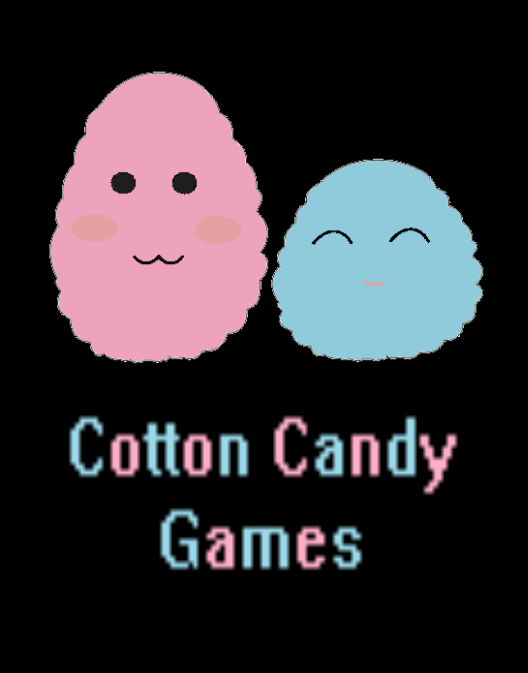 ](JulianaBL.github.io/Ventania/)

* Tema: Mensagem
>Descrição:<   
O objetivo do jogo Ventania e fazer com que o jogador coloque as  cartas corretas no correio, para assim poder ganhar a sua devida pontuação.

[ 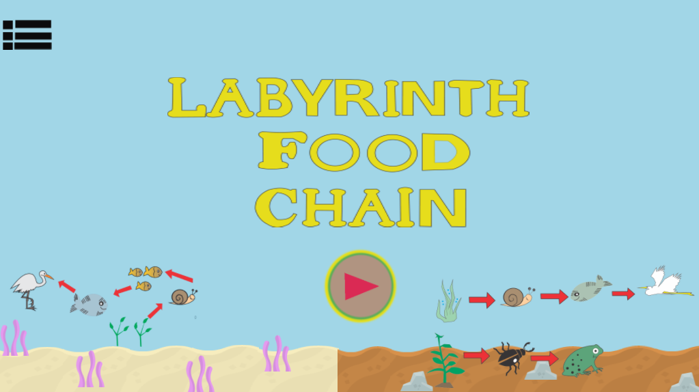](JulianaBL.github.io/LabyrinthFoodChain/)

* Tema: Livre
>Descrição:<      
É um jogo de labirinto onde o jogador tem que ajudar o personagem a encontrar sua presa correta, jogo educativo voltado para a aréa de Biologia, onde você aprende um pouco sobre as cadeias alimentares terrestres e aquáticas.

[ 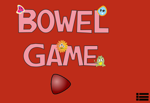](https://karlagabriella.github.io/New%20project/) 

* Tema: Saúde
>Descrição:<       
É um jogo do tipo Tower Defense onde ao decorrer do jogo você tem que ajudar as bactérias boas do intestino a se defender das bactérias ruins.

## Mockup

>Tema: Mistério
* Mystery Adventure

# 
 

## Artes
 
         
      
           
   

## Premiações
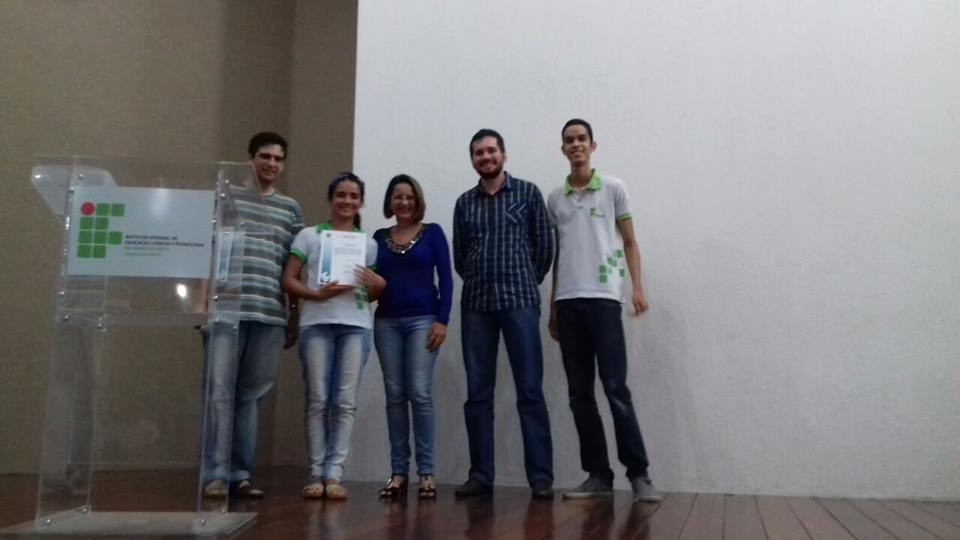

Concurso de poemas - 1 Lugar 15/02/2017

## Projetos de Extensão

> Projeto Clube Da Leitura
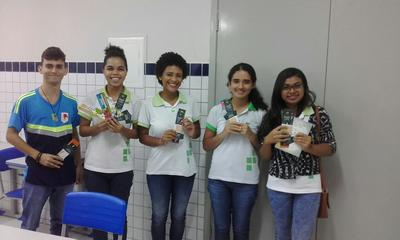

O projeto “Clube da leitura - IFRN Ceará-Mirim” objetiva estimular e intensificar o interesse pela leitura literária dentro e fora da escola. Para isso, faz-se necessário recorrer a obras de diferentes autores, estilos e escolas literárias. Haverá dois grupos: um no turno matutino e outro no turno vespertino. Os encontros serão mensais, nas segundas-feiras pela manhã e à tarde, a fim de abranger alunos que estudam em ambos os turnos. Neste ano, abriremos, em cada turno, quinze vagas para os alunos do campus e cinco vagas para a comunidade externa. Os participantes serão avaliados a cada encontro, tanto pela assiduidade quanto pela participação ativa. Além disso, os professores envolvidos no projeto terão reuniões mensais com os bolsistas voluntários para organização e planejamento das ações futuras e avaliação dos encontros realizados.

> Projeto PraVCComunidade

Este projeto visa criar uma empresa fictícia, denominada PraVcComunidade, com o objetivo de divulgar a produção acadêmica, artística, cultural e de ensino do Campus Ceará-Mirim, assim como trabalhos relacionados ao eixo tecnológico deste campus, visando informar a comunidade cearamirinense, bem como estimular alunos da região, potenciais ingressantes nos cursos do Campus, a serem alunos do IFRN. Para tanto, os alunos, participantes do projeto, executarão funções administrativas: planejamento, organização, liderança e controle, inerentes a quaisquer processos administrativos, englobando o atendimento ao cliente, a produção de conteúdo e a publicação das notícias na FanPage oficial do IFRN/Ceará-Mirim.

>Projeto Jogos: Realizados na disciplina de motores e oficina de jogos.   
>Projeto Pesquisa: Rio Maceió e seus Impactos ambientais.   
>Projeto: A Visibilidade do Invisível 

## Influence Map

   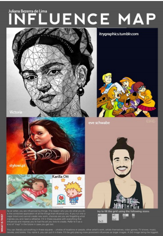
   
## O que faço nos meus tempos livres? Além de estudar.

* Praia;   
* Igreja;   
* Andar de Bicicleta com os Primos;   
* Passear com a familia;   
* Ler livros acumulados.   
   
## Viajens IFRN
* 
   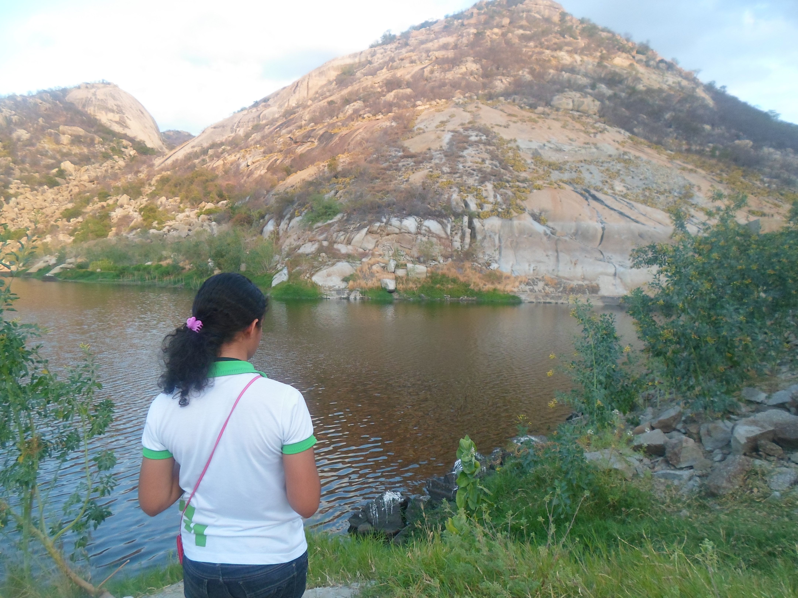 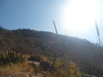    

* Macau/RN
    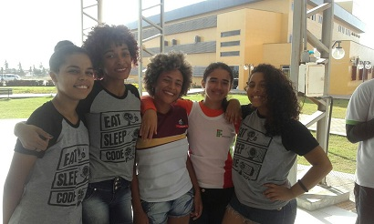
    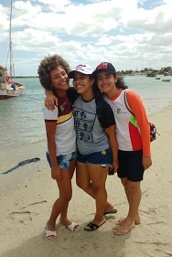
    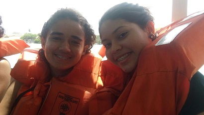
    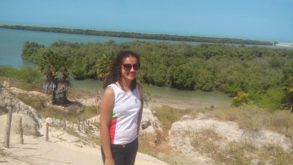
    
## Registros Pôr do sol 
📷_JulianaLima14

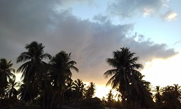   
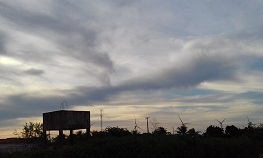   
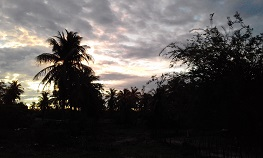   
    

