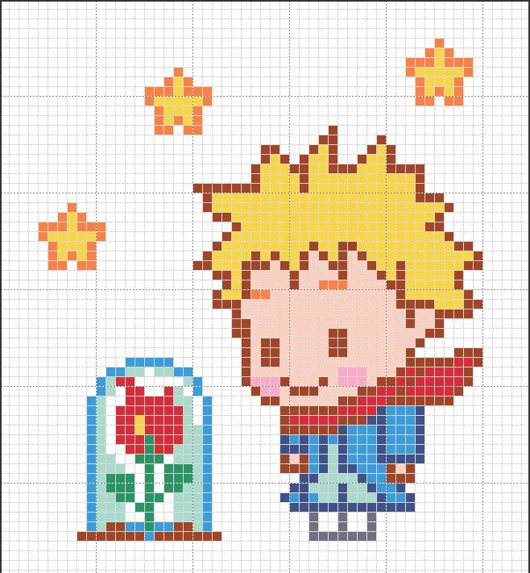

#"O sorriso esconde infinitos pretextos." 💚

# Quem sou eu

Meu nome é Juliana Bezerra de Lima, tenho 17 anos estudo no Ifrn/Ceará-Mirim no Curso de Jogos Digitais, estou usando esse site para fazer um portfólio da materia de Motores,com o Professor Marcelo Barbosa. 

# Informações pessoais
Julianalima14   
Julianabezerra.touros@gmail.com      
JujuLima

# Portfólio

# Frase Motivadora
"A felicidade está nas coisas mais simples da vida." 

## Games
         

  

 

## Artes

## Projetos
* Proj Teatro 
* Proj Musica 
* Proj Jogos

*  *   *

**negrito    
_itálico    
~~riscado   
3* linha horizontal (barra)
#s uma ou mais hashtags criam capitulos ou sub
*s asteristicos criam listas não ordenada
1s números criam lista ordenada 

*  *  * 
