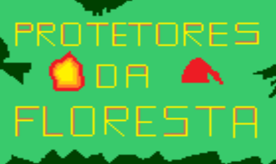

# Quem sou eu

Sou estudante do IFRN/Campus Ceará-Mirim, do curso técnico em Programação de Jogos Digitais. 
Nessa página, vou adicionar algumas informaçãoes sobre minha pessoa. O que eu gosto de fazer, e sobre alguns trabalhos que fiz ao longo do ano.
# Informações pessoais
Julianalima14   
Julianabezerra.touros@gmail.com      
JujuLima

# Portfólio

# Frase Motivadora
"A felicidade está nas coisas mais simples da vida." 

## Games
         

  

 

[TEXTO QUE VAI APARECER (link)

## Artes

## Projetos
* Proj Teatro 
* Proj Musica 
* Proj Jogos

*  *   *

**negrito    
_itálico    
~~riscado   
3* linha horizontal (barra)
#s uma ou mais hashtags criam capitulos ou sub
*s asteristicos criam listas não ordenada
1s números criam lista ordenada 

*  *  * 
