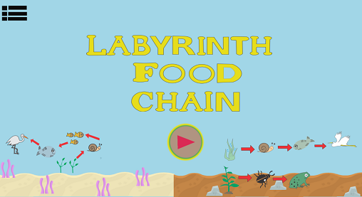

 
#    
*  *   *   
     
# "O sorriso esconde infinitos pretextos." -Lucas Lavarini 💚
 

# Quem sou eu

Meu nome é Juliana Bezerra de Lima, tenho 17 anos estudo no Ifrn/Ceará-Mirim no Curso de Jogos Digitais, estou usando esse site para fazer um portfólio da materia de Motores, com o Professor Marcelo Barbosa. 

# Informações pessoais
Email:Julianabezerra.touros@gmail.com   
       
   

# Portfólio

# Frase Motivadora
#  
# "A felicidade está nas coisas mais simples da vida." 

## Empresa

# 
 
## Games

>Tema: Cultura   
>Descrição:
No jogo Protetores da Floresta com a sua ajuda o Saci ou Curupira tem a missão de salvar a floresta dos lenhadores para assim salvar as suas árvores. 

>Tema: Mensagem

>Descrição:  

>Tema: Livre

>Descrição:
É um jogo de labirinto onde o jogador tem que ajudar o personagem a encontrar sua presa correta, jogo educativo voltado para a aréa de Biologia, onde você aprende um pouco sobre as cadeias alimentares terrestres e aquáticas.

 

>Descrição: 
É um jogo do tipo Tower Defense onde ao decorrer do jogo você tem que ajudar as bacterias boas do intestino a se defender das bacterias ruins. 

## Mockup

* Mystery Adventure
>Tema: Mistério

# 
 

## Artes

## Premiações

Concurso de poemas - 1 Lugar 15/02/2017

## Projetos de Extensão

> Projeto Clube Da Leitura

O projeto “Clube da leitura - IFRN Ceará-Mirim” objetiva estimular e intensificar o interesse pela leitura literária dentro e fora da escola. Para isso, faz-se necessário recorrer a obras de diferentes autores, estilos e escolas literárias. Haverá dois grupos: um no turno matutino e outro no turno vespertino. Os encontros serão mensais, nas segundas-feiras pela manhã e à tarde, a fim de abranger alunos que estudam em ambos os turnos. Neste ano, abriremos, em cada turno, quinze vagas para os alunos do campus e cinco vagas para a comunidade externa. Os participantes serão avaliados a cada encontro, tanto pela assiduidade quanto pela participação ativa. Além disso, os professores envolvidos no projeto terão reuniões mensais com os bolsistas voluntários para organização e planejamento das ações futuras e avaliação dos encontros realizados.

> Projeto PraVCComunidade

Este projeto visa criar uma empresa fictícia, denominada PraVcComunidade, com o objetivo de divulgar a produção acadêmica, artística, cultural e de ensino do Campus Ceará-Mirim, assim como trabalhos relacionados ao eixo tecnológico deste campus, visando informar a comunidade cearamirinense, bem como estimular alunos da região, potenciais ingressantes nos cursos do Campus, a serem alunos do IFRN. Para tanto, os alunos, participantes do projeto, executarão funções administrativas: planejamento, organização, liderança e controle, inerentes a quaisquer processos administrativos, englobando o atendimento ao cliente, a produção de conteúdo e a publicação das notícias na FanPage oficial do IFRN/Ceará-Mirim.

>Projeto Jogos: Realizados na disciplina de motores e oficina de jogos.

>Projeto Pesquisa: Rio Maceió e seus Impactos ambientais

## Influence Map

   
   
## O que faço nos meus tempos livres? Além de estudar.

> Ir a praia;
> Igreja;
> Andar de Bicicleta com os Primos;
> Passear com a familia;
> Ler livros acumulados;
   

